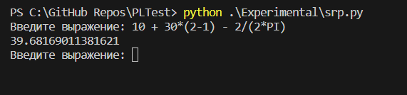

# Expreriments

## Shift Reduce parsing

[Simple calcculator in Python powered by shift-reduce parsing](./srp.py)

I like this parsing algorithm, but I still can't figure out how to find syntax errors in the code.